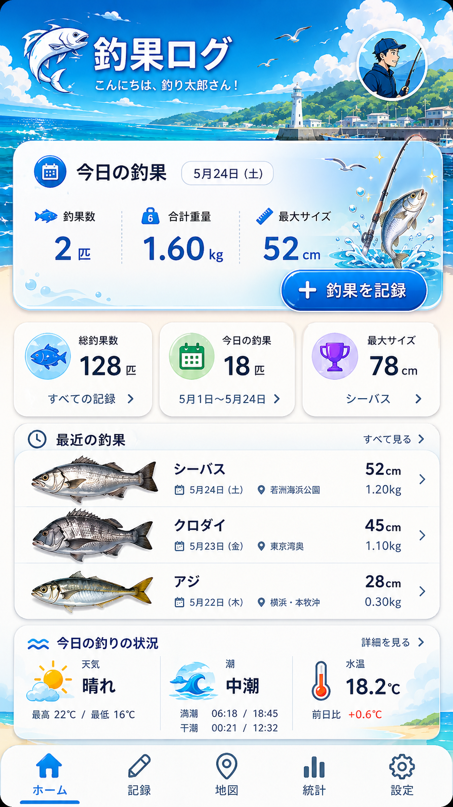

# catch-management

<p align="center">
  
</p>

釣行、釣果、ポイント、ルアーを記録し、あとから統計で振り返るための釣果管理アプリです。

フロントエンドは Next.js、バックエンドは FastAPI、認証とデータ保存は Supabase を使います。バックエンドは Supabase の `anon` key だけを持ち、ブラウザから受け取ったユーザー JWT を PostgREST に中継することで Row Level Security に認可を任せる構成です。

## 主な機能

- メールアドレス / パスワードによるログイン
- ポイント管理
- ルアー管理
- 釣行の記録、編集、削除
- 釣行に紐づく釣果の記録、編集、削除
- 月別、ルアー別の統計表示
- Supabase RLS によるユーザーごとのデータ分離

## 使用技術

| 領域 | 技術 |
|---|---|
| Frontend | Next.js 16, React 19, TypeScript, Tailwind CSS v4, Recharts |
| Backend | FastAPI, Pydantic v2, supabase-py |
| Auth / DB | Supabase Auth, PostgreSQL, Row Level Security, PostgREST |
| Test | pytest, FastAPI TestClient, Vitest, Testing Library |
| CI | GitHub Actions |

## 構成

```text
.
├── backend/                 # FastAPI API
│   ├── main.py              # FastAPI app, CORS, exception handlers
│   ├── auth.py              # JWT 検証と user-scoped Supabase client
│   ├── supabase_client.py   # Supabase URL / anon key と認証検証用 client
│   ├── routers/             # spots / sessions / catches / lures
│   └── tests/               # pytest unit + integration tests
├── frontend/                # Next.js App Router app
│   ├── app/                 # pages and layouts
│   ├── components/          # shared UI components
│   ├── lib/                 # apiFetch, Supabase client, shared types
│   └── tests/               # Vitest + Testing Library
├── docs/
│   ├── architecture.md      # architecture snapshot
│   ├── database-setup.md    # Supabase schema and setup details
│   ├── testing.md           # test strategy and CI details
│   ├── known-issues.md      # bug history
│   └── code-review.md       # review/refactoring backlog
└── .github/workflows/ci.yml
```

## セットアップ

### 1. clone

```bash
git clone https://github.com/satoru-oka/catch-management.git
cd catch-management
```

### 2. Supabase

Supabase プロジェクトを作成し、テーブルと RLS ポリシーを作成します。SQL と詳しい手順は [docs/database-setup.md](docs/database-setup.md) を参照してください。

開発用のバックエンドでは `service_role` key を使いません。`service_role` key は実 Supabase を使う結合テストで、使い捨てユーザーを作成 / 削除するためだけに使います。

### 3. Backend

Python 3.10 以上が必要です。CI では Python 3.14 で検証しています。

```bash
cd backend
python -m venv venv
source venv/bin/activate
pip install -r requirements.txt
cp .env.example .env
```

`backend/.env` に Supabase の値を入れます。

```env
SUPABASE_URL=https://xxxx.supabase.co
SUPABASE_ANON_KEY=your_anon_key_here
SUPABASE_JWT_SECRET=your_jwt_secret_here
ALLOWED_ORIGINS=http://localhost:3000
```

起動:

```bash
uvicorn main:app --reload
```

Swagger UI: [http://localhost:8000/docs](http://localhost:8000/docs)

### 4. Frontend

Node.js 22 系を推奨します。CI でも Node.js 22 を使っています。

```bash
cd frontend
npm install
```

`frontend/.env.local` を作成し、Supabase と API の URL を入れます。

```env
NEXT_PUBLIC_SUPABASE_URL=https://xxxx.supabase.co
NEXT_PUBLIC_SUPABASE_ANON_KEY=your_anon_key_here
NEXT_PUBLIC_API_URL=http://localhost:8000
```

起動:

```bash
npm run dev
```

アプリ: [http://localhost:3000](http://localhost:3000)

## 環境変数

実 key は README に書かず、ローカルの `.env` / `.env.local` / `.env.test` にだけ置きます。

### Backend runtime (`backend/.env`)

| 変数 | 用途 |
|---|---|
| `SUPABASE_URL` | Supabase project URL |
| `SUPABASE_ANON_KEY` | RLS 前提で使う anon key |
| `SUPABASE_JWT_SECRET` | FastAPI 側で JWT をローカル検証するための secret |
| `ALLOWED_ORIGINS` | CORS 許可 origin。カンマ区切りで複数指定可 |

テンプレート: [backend/.env.example](backend/.env.example)

### Frontend runtime (`frontend/.env.local`)

| 変数 | 用途 |
|---|---|
| `NEXT_PUBLIC_SUPABASE_URL` | ブラウザ用 Supabase project URL |
| `NEXT_PUBLIC_SUPABASE_ANON_KEY` | ブラウザ用 anon key |
| `NEXT_PUBLIC_API_URL` | FastAPI の base URL |

### Backend integration test (`backend/.env.test`)

| 変数 | 用途 |
|---|---|
| `TEST_SUPABASE_URL` | 結合テスト用 Supabase project URL |
| `TEST_SUPABASE_ANON_KEY` | 結合テスト用 anon key |
| `TEST_SUPABASE_SERVICE_ROLE_KEY` | テストユーザー作成 / 削除だけに使う service role key |
| `TEST_USER_EMAIL` / `TEST_USER_PASSWORD` | 結合テスト用ユーザー A |
| `TEST_USER2_EMAIL` / `TEST_USER2_PASSWORD` | 結合テスト用ユーザー B |

テンプレート: [backend/.env.test.example](backend/.env.test.example)

## 開発コマンド

### Backend

```bash
cd backend
source venv/bin/activate
uvicorn main:app --reload
pytest
pytest -m "not integration"
pytest -m integration
```

`pytest -m integration` は実 Supabase に接続します。必要な環境変数やテスト用プロジェクトの作り方は [docs/database-setup.md](docs/database-setup.md) と [docs/testing.md](docs/testing.md) を参照してください。

### Frontend

```bash
cd frontend
npm run dev
npm test
npm run test:watch
npm run lint
```

## テストと CI

通常の単体テストは Supabase に接続しません。

- backend unit: `backend/tests/conftest.py` が fake Supabase client を依存性注入します。
- backend integration: `backend/tests/integration/` が実 Supabase、Auth、RLS、PostgREST を検証します。`TEST_SUPABASE_*` が無い場合は skip されます。
- frontend unit: Vitest と Testing Library で `fetch`, Supabase, Next navigation を mock します。

GitHub Actions は backend、frontend、integration の 3 job を実行します。詳細は [docs/testing.md](docs/testing.md) を参照してください。

## 関連ドキュメント

- [docs/architecture.md](docs/architecture.md): アーキテクチャ、認証フロー、データモデル
- [docs/database-setup.md](docs/database-setup.md): Supabase プロジェクト、schema、RLS、結合テスト用 DB
- [docs/testing.md](docs/testing.md): テスト戦略、fixture、CI
- [docs/known-issues.md](docs/known-issues.md): 発見済みバグと修正履歴
- [docs/code-review.md](docs/code-review.md): 改善候補と GitHub issue 対応状況

## 今後の改善予定

長い TODO は README に抱え込まず、[GitHub issues](https://github.com/satoru-oka/catch-management/issues) と [docs/code-review.md](docs/code-review.md) で管理します。

現在の主な候補:

- 写真アップロード (釣果に画像を添付)
- パスワードリセット / メールアドレス変更
- ホーム以外からの統計画面導線改善
- オフライン入力 (PWA / IndexedDB)

## 開発メモ

- ローカル用の `.env`, `.env.local`, `.env.test` は gitignore 済みです。実 key は commit しないでください。
- `backend/.env.example` と `backend/.env.test.example` はテンプレートとして管理しています。
- Backend runtime では Supabase `service_role` key を使わない方針です。
- Next.js 16 は従来バージョンと差分が大きいため、フロント実装時は [frontend/AGENTS.md](frontend/AGENTS.md) の注意も確認してください。
