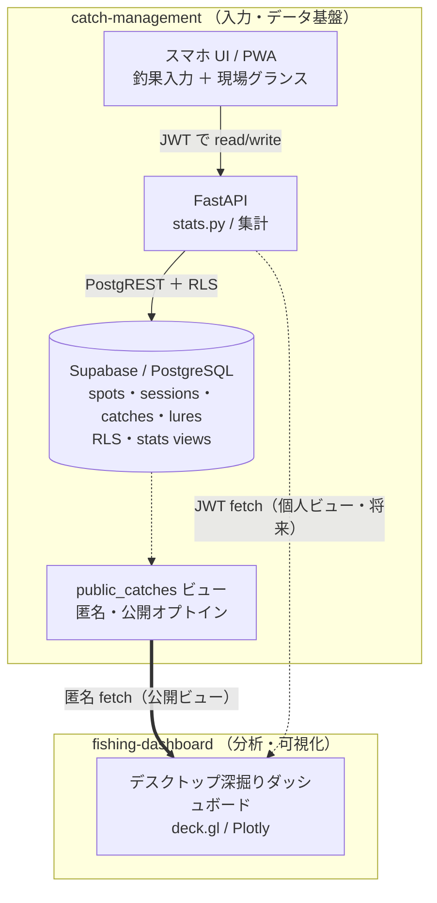

# システム全体像（catch-management ↔ fishing-dashboard）

東京湾を軸にした釣果管理の 2 アプリ構成。**疎結合（パターンA）** で、データ基盤（Supabase）を共有する。詳細な内部設計は `docs/architecture.md` を参照。

- **catch-management** … スマホ入力アプリ（Next.js / PWA）＋ FastAPI ＋ Supabase。データの保存・認証(RLS)・集計を担う。現場グランス（軻い集計）もここ。
- **fishing-dashboard** … 分析・可視化（Vite / deck.gl / Plotly）。データは保存せず、取得して描くだけ。重い深掘り分析はデスクトップで。

## 関係の要点

- **データの所有は catch-management**。fishing-dashboard は読み手・描き手で、DB を持たない。
- **取得経路は 2 本**: 公開ビュー（匿名集計）と、個人ビュー（JWT 認証・将来）。
- **現状の fishing-dashboard は CSV 読み込み**で、API fetch への差し替えが移行ステップ。
- deck.gl/Plotly は重いのでモバイルに載せず、デスクトップに分離（疎結合の理由）。

## 関連ドキュメント

- catch-management: `docs/architecture.md` / `docs/database-setup.md` / `supabase/migrations/001_dual_domain_schema.sql`
- fishing-dashboard: `docs/field-glance-metrics.md`、統合の経緯 #40
