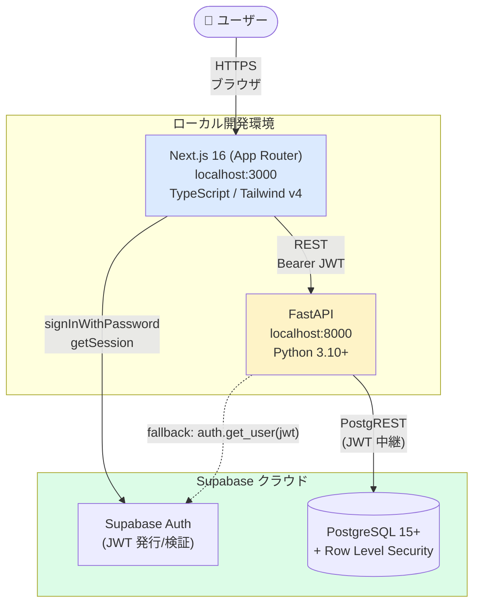
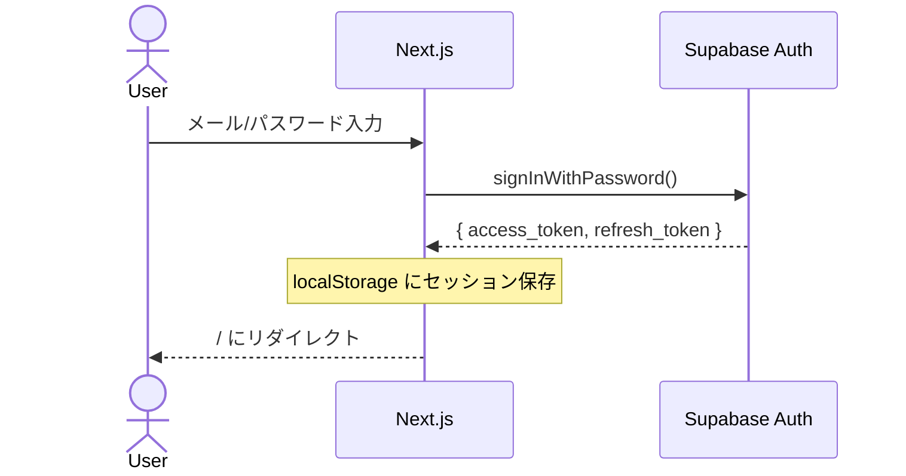
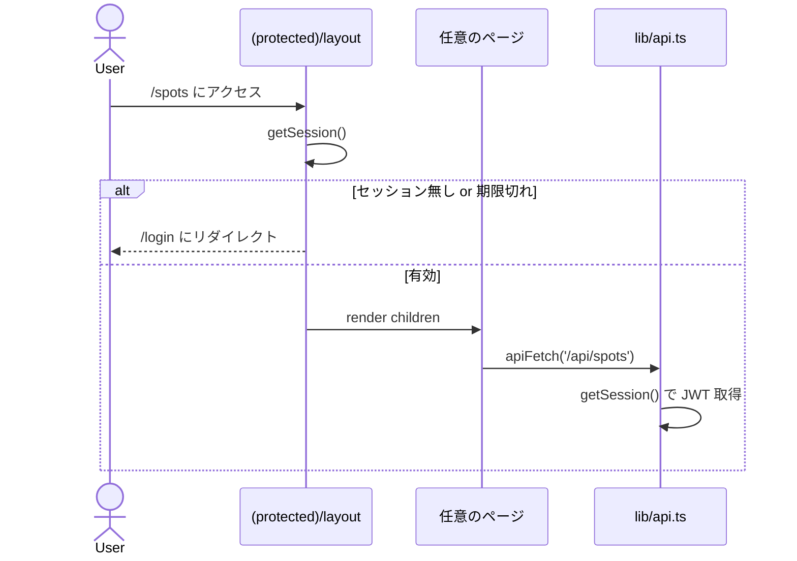
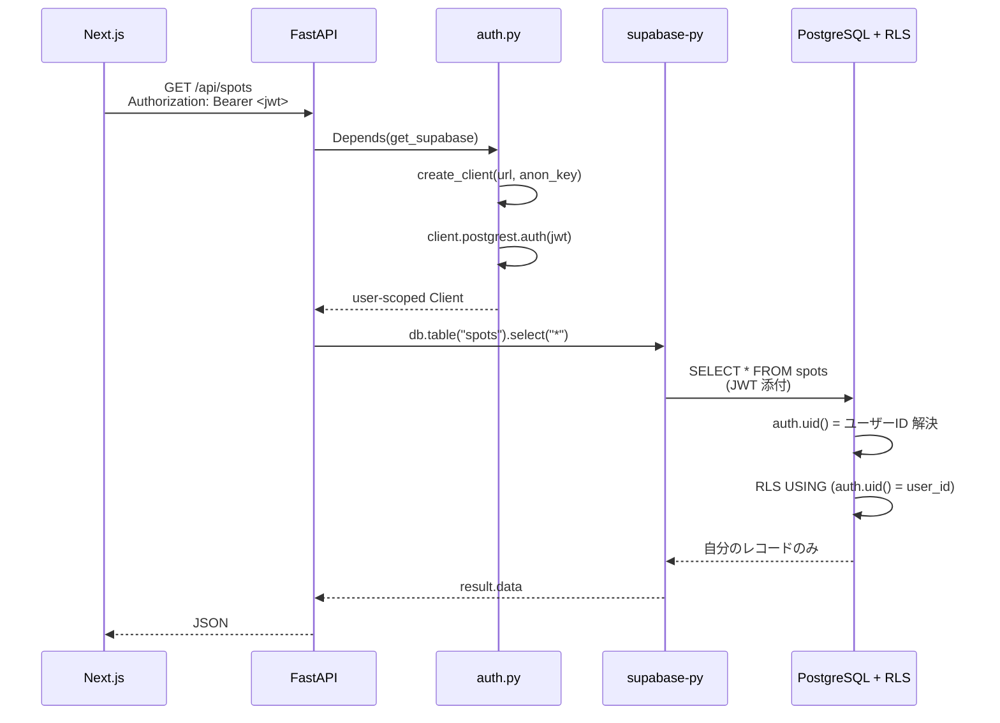
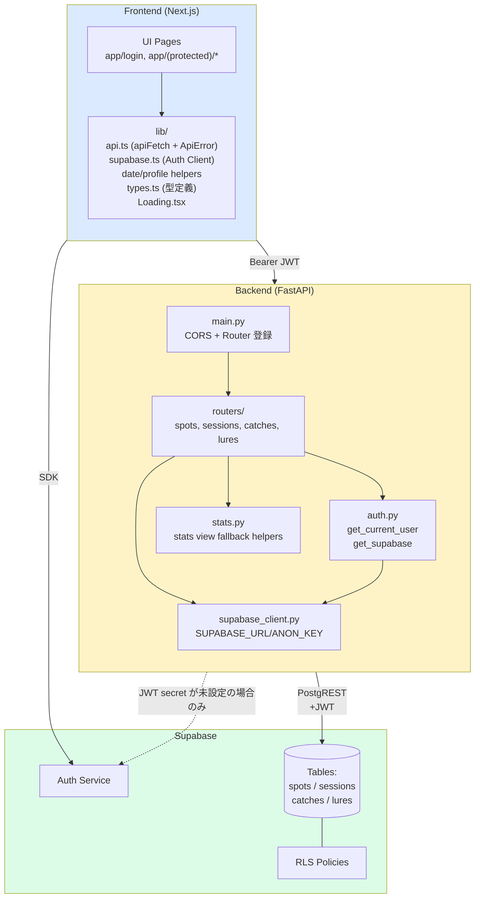
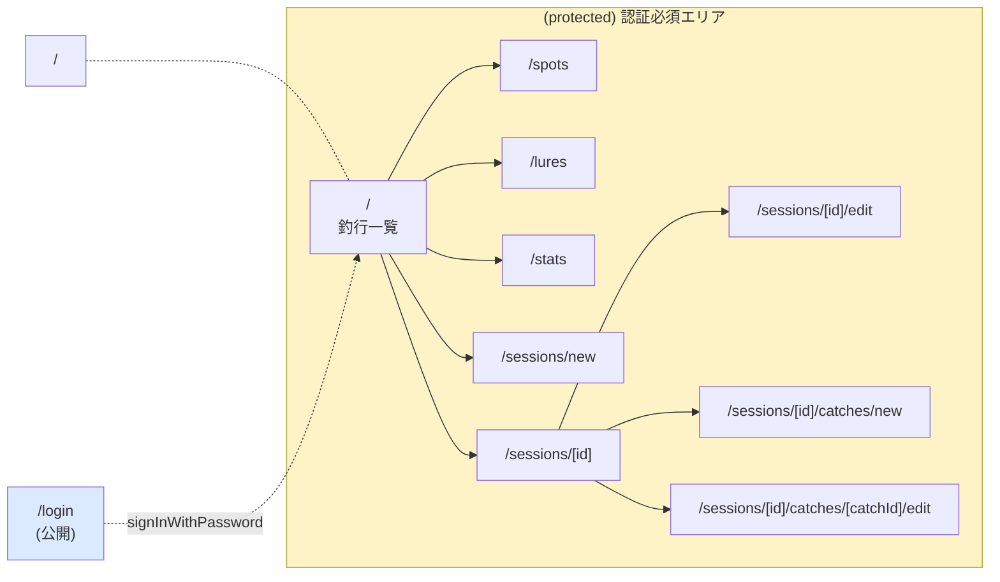
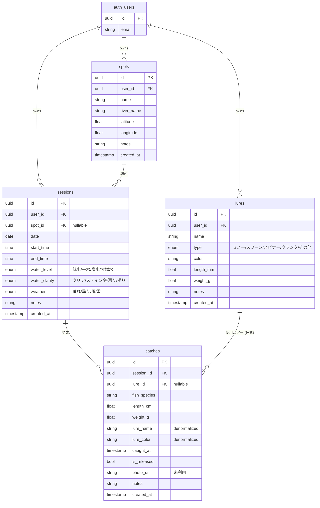

# Architecture Snapshot

> **Last updated**: 2026-06-03
> **Branch**: `main`
> **Purpose**: 将来の改修と比較するための、現時点のシステム全体スナップショット。
>
> このドキュメントは「凍結された一時点の写真」です。コード/構成を大きく変更したら
> このセクションを `## Revision history` に移し、新しい現状を上書きしてください。

---

## 1. システム全体像 (Container view)



**要点**:

- バックエンドは **anon key のみ** 保有 (`service_role` 不使用)
- `SUPABASE_JWT_SECRET` が設定されている場合、FastAPI はユーザー JWT をローカル検証する
- DB アクセスは「ユーザーの JWT を PostgREST にそのまま中継」する方式 → DB 内部で `auth.uid()` が解決され RLS が効く
- 認可ロジックがアプリ層に分散しないため、`.eq("user_id", ...)` の書き忘れによるデータ漏洩が構造的に発生しない

---

## 2. 認証・認可フロー

### 2.1 ログイン



### 2.2 認証必須ページの初回表示



### 2.3 API リクエスト → DB アクセス (最重要)



**ポイント**: ルーター内に `.eq("user_id", user_id)` が **存在しない** にも関わらず、DB 側 RLS によって他人のデータは絶対に返らない。

---

## 3. レイヤード構成



`catches.lure_name` / `catches.lure_color` は履歴保存用の denormalized snapshot として扱う。`lure_id` が指すルアーマスターを後から rename / recolor しても、過去の釣果表示とルアー別統計は当時保存された snapshot 名を維持する。`lure_id` が `NULL` の自由入力や、ルアー削除後の履歴を自然に扱うための意図的な設計とする。

---

## 4. ページ構成と保護対象



**Route Group `(protected)` の意味**: フォルダ名 `(protected)` は URL に現れない。`(protected)/layout.tsx` だけが認証チェックを担い、配下のすべてのページがその恩恵を受ける。

---

## 5. データモデル (ER 図)



### RLS ポリシー一覧

| テーブル | ポリシー | 適用範囲 |
|---|---|---|
| `spots` | `auth.uid() = user_id` | SELECT/INSERT/UPDATE/DELETE |
| `sessions` | `auth.uid() = user_id` | 同上 |
| `lures` | `auth.uid() = user_id` | 同上 |
| `catches` | `session_id IN (SELECT id FROM sessions WHERE user_id = auth.uid())` | 同上 (親 session 経由) |

> Postgres では `WITH CHECK` を省略すると `USING` 式が INSERT/UPDATE にも流用される。
> したがって上記 1 行だけで全 4 操作が保護される。

---

## 6. ページ ↔ API 対応表

| ページ | 主な API 呼び出し |
|---|---|
| `/` | `GET /api/sessions` |
| `/login` | (Supabase Auth SDK 直接) |
| `/spots` | `GET/POST/PUT/DELETE /api/spots` |
| `/lures` | `GET/POST/PUT/DELETE /api/lures` |
| `/stats` | `GET /api/sessions/stats/monthly`, `/api/lures/stats`, `/api/catches` |
| `/sessions/new` | `GET /api/spots`, `POST /api/sessions` |
| `/sessions/[id]` | `GET /api/sessions/{id}`, `DELETE /api/sessions/{id}` |
| `/sessions/[id]/edit` | `GET /api/sessions/{id}`, `GET /api/spots`, `PUT /api/sessions/{id}` |
| `/sessions/[id]/catches/new` | `GET /api/lures`, `POST /api/sessions/{id}/catches` |
| `/sessions/[id]/catches/[catchId]/edit` | `GET /api/catches/{catchId}`, `GET /api/lures`, `PUT/DELETE /api/catches/{catchId}` |

---

## 7. 規模スナップショット (2026-06-03)

将来の比較に使えるよう、現時点の数値を凍結して記録します。

### コード量

| 項目 | 値 |
|---|---|
| Backend runtime Python LoC | 618 行 |
| Frontend runtime TS/TSX LoC | 2,291 行 |
| Backend runtime `.py` ファイル | 8 |
| Frontend page.tsx | 11 |
| Frontend runtime `.ts/.tsx` 総数 | 23 |
| FastAPI app エンドポイント総数 | 24 (`/api/*` は 22) |
| DB テーブル数 | 4 |

### FastAPI app エンドポイント (24 個)

```
GET    /                                    GET    /healthz

GET    /api/spots/                          POST   /api/spots/
GET    /api/spots/{spot_id}                 PUT    /api/spots/{spot_id}
DELETE /api/spots/{spot_id}                 GET    /api/spots/{spot_id}/sessions

GET    /api/sessions/                       POST   /api/sessions/
GET    /api/sessions/stats/monthly          GET    /api/sessions/{session_id}
PUT    /api/sessions/{session_id}           DELETE /api/sessions/{session_id}
POST   /api/sessions/{session_id}/catches

GET    /api/catches                         GET    /api/catches/{catch_id}
PUT    /api/catches/{catch_id}              DELETE /api/catches/{catch_id}

GET    /api/lures/                          POST   /api/lures/
GET    /api/lures/stats                     PUT    /api/lures/{lure_id}
DELETE /api/lures/{lure_id}
```

### 主要依存

| パッケージ | バージョン |
|---|---|
| Next.js | 16.2.4 |
| React | 19.2.4 |
| TypeScript | ^5 |
| Tailwind CSS | ^4 |
| recharts | ^3.8.1 |
| @supabase/supabase-js | ^2.105.3 |
| FastAPI | 0.136.1 |
| Pydantic | 2.13.3 |
| supabase (python) | 2.29.0 |
| python-jose | 3.5.0 |

### Next.js ビルドルート (production)

```
○ /                                              (Static)
○ /_not-found                                    (Static)
○ /login                                         (Static)
○ /lures                                         (Static)
○ /spots                                         (Static)
○ /sessions/new                                  (Static)
○ /stats                                         (Static)
ƒ /sessions/[id]                                 (Dynamic)
ƒ /sessions/[id]/catches/[catchId]/edit          (Dynamic)
ƒ /sessions/[id]/catches/new                     (Dynamic)
ƒ /sessions/[id]/edit                            (Dynamic)
```

---

## 8. 設計上の主要な決定 (Decision log)

各決定は `WHY` を記録しておくと、将来「なぜこうしたんだっけ」を即座に思い出せます。

| 日付 | 決定 | 理由 (Why) |
|---|---|---|
| 2026-05-06 | バックエンドから `service_role` を排除し RLS に認可を集約 | アプリ層で `.eq("user_id", ...)` を 1 箇所書き忘れたら全データ漏洩、というリスクを構造的に消すため |
| 2026-05-06 | `(protected)` ルートグループで認証ガードを 1 箇所に集約 | 個別ページに認証チェックをコピペすると忘れが必ず発生するため |
| 2026-05-06 | 当初は `apiFetch` で 401 自動サインアウト+リダイレクト | トークン期限切れで「読み込み中...」のまま固まる UX を回避する初期実装 |
| 2026-05-06 | `lib/types.ts` に API レスポンスの型を一元化 | API スキーマが変わった時のコンパイルエラーで影響範囲が即座に判明する |
| 2026-05-06 | recharts を `next/dynamic` で `/stats` のみに分離 | ライブラリが他ページの初期バンドルに混入しないようにするため |
| 2026-05-06 | `catches` のみ親 session 経由で認可 (RLS が `session_id IN (...)`) | 釣果は単独で意味を持たず、必ず釣行に従属するためデータモデル上自然 |
| 2026-05-20 | 401 の signOut / redirect は `(protected)/layout.tsx` に集約 | `apiFetch` は 401 を通知して `ApiError` を投げ、認証状態の破棄と遷移は auth boundary が担う |
| 2026-05-20 | 統計 API は `security_invoker` view を優先し、未作成環境では従来集計へ fallback | RLS を維持しながら DB 集計へ移行し、既存 Supabase project の段階的更新を可能にする |
| 2026-05-20 | `catches.lure_name` / `lure_color` は履歴 snapshot として drift を許容 | ルアー rename 後も過去釣果の当時表記を維持し、自由入力・削除済みルアー履歴を扱うため |

---

## 9. 既知の制約・改善候補

| カテゴリ | 内容 | 優先度の目安 |
|---|---|---|
| **未実装機能** | 写真アップロード (`catches.photo_url` カラムは存在) | 中 |
| **未実装機能** | パスワードリセット / アカウント作成 UI | 低 (個人利用なら) |
| **テスト** | E2E / Storybook なし。pytest integration は `TEST_SUPABASE_*` 設定時のみ実 Supabase に接続 | 中 |
| **パフォーマンス** | `SUPABASE_JWT_SECRET` 未設定時は `auth.get_user(token)` fallback で外部問い合わせが発生 | 低 (JWT secret 設定で解消) |
| **パフォーマンス** | 統計 view 未作成の Supabase project では Python 集計 fallback になる | 中 (view 作成で解消) |
| **コード品質** | spots / lures ページの CRUD ロジックが重複 | 中 |
| **コード品質** | API レスポンスの型定義が手動同期 (Pydantic ↔ TypeScript) | 中 (OpenAPI 自動生成余地) |
| **DX** | E2E テストやストーリーブック等の UI 検証フローなし | 低 |

---

## 10. ディレクトリツリー (記録用)

```
catch-management/
├── README.md
├── docs/
│   └── architecture.md           ← このドキュメント
├── backend/
│   ├── main.py
│   ├── supabase_client.py
│   ├── auth.py
│   ├── stats.py
│   ├── CLAUDE.md
│   ├── pyproject.toml            (Ruff 設定)
│   ├── requirements.txt
│   ├── .env.example
│   └── routers/
│       ├── spots.py
│       ├── sessions.py
│       ├── catches.py
│       └── lures.py
└── frontend/
    ├── package.json
    ├── tsconfig.json
    ├── next.config.ts
    ├── eslint.config.mjs
    ├── postcss.config.mjs
    ├── .env.local.example
    ├── app/
    │   ├── layout.tsx
    │   ├── globals.css
    │   ├── login/page.tsx
    │   └── (protected)/
    │       ├── layout.tsx              ← 認証ガード
    │       ├── page.tsx                ← トップ (釣行一覧)
    │       ├── spots/page.tsx
    │       ├── lures/page.tsx
    │       ├── stats/
    │       │   ├── page.tsx
    │       │   └── charts.tsx          ← recharts 分離 (遅延ロード対象)
    │       └── sessions/
    │           ├── new/page.tsx
    │           └── [id]/
    │               ├── page.tsx
    │               ├── edit/page.tsx
    │               └── catches/
    │                   ├── new/page.tsx
    │                   └── [catchId]/edit/page.tsx
    └── lib/
        ├── supabase.ts
        ├── api.ts
        ├── date.ts
        ├── profile.ts
        ├── types.ts
        └── Loading.tsx
```

---

## Revision history

このドキュメントを大きく更新するたびにここへ要約を追記してください。

| 日付 | リビジョン | 主な変更 |
|---|---|---|
| 2026-05-06 | r1 | 初版。`service_role` 排除 + 認証ガード + 編集 UI 追加後の状態を記録 |
| 2026-06-03 | r2 | §7 を再計測。旧スナップショットは Backend 434 LoC / Frontend 1,851 LoC / backend 7 files / page.tsx 10 / frontend 17 files / API endpoint 22 |
