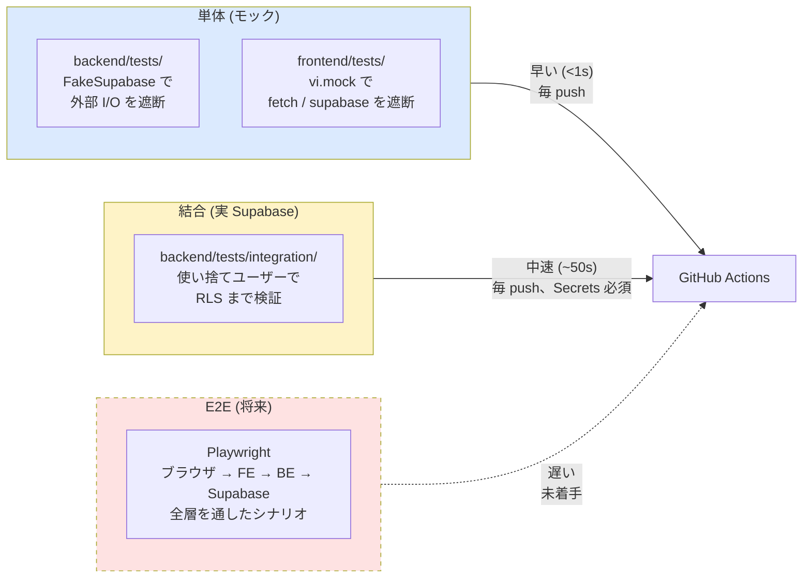
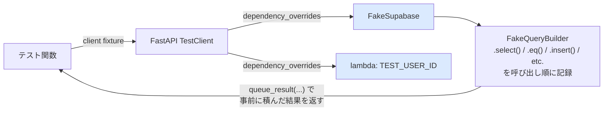
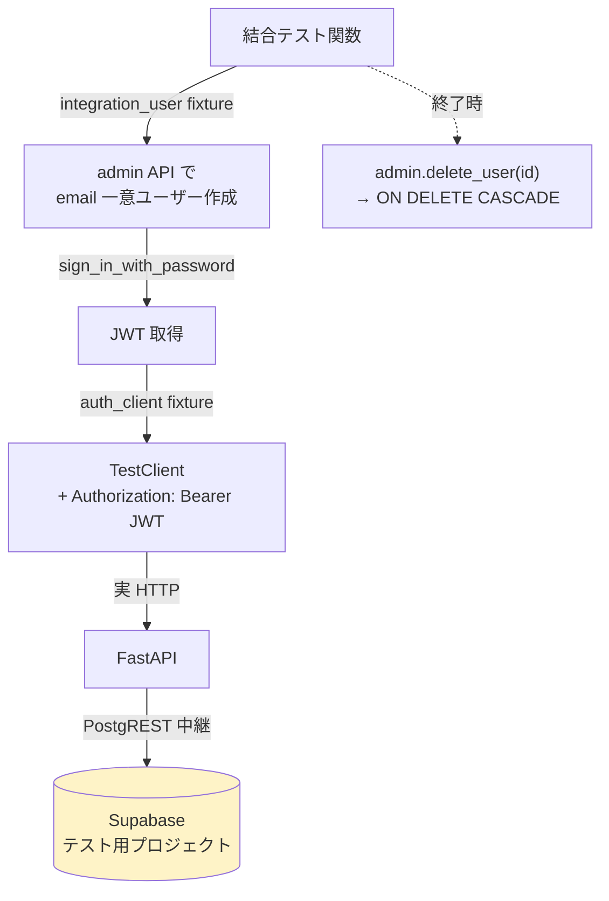
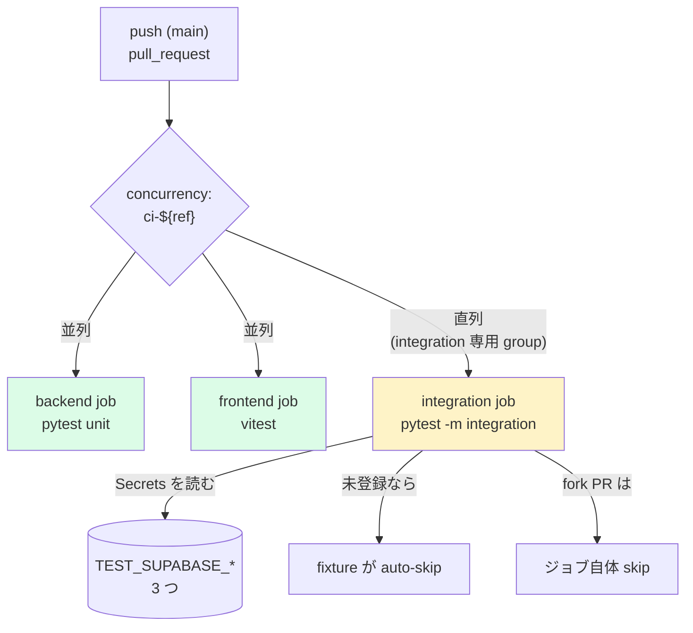

# Testing Snapshot

> **Last updated**: 2026-05-06
> **Branch**: `feature/test-suite`
> **Purpose**: テスト/CI の全体像と現在地を 1 ページで俯瞰する。`README.md` の
> 「6. テスト」(動かし方) と `docs/known-issues.md` (バグ詳細) の中間に位置する
> 「全体図」ドキュメント。
>
> このドキュメントはスナップショットです。テスト構成や件数を大きく変えたら
> このセクションを `## Revision history` に移し、新しい現状を上書きしてください。

---

## 1. テスト戦略の全体像

**ピラミッドの意図**:

- **単体** で速く広く回し、コードレベルの誤りを毎 push で潰す
- **結合** で「アプリ層 + Supabase Auth + RLS + PostgREST」の境界をたまに踏む
- **E2E** はブラウザを含めた最終ルートの確認 (まだ未着手)

詳細な動かし方は [`README.md` の「6. テスト」](../README.md) を参照。

---

## 2. 現在のカバレッジ (合計 168 件)

| レイヤ | 場所 | 件数 | 外部依存 | 主な観点 |
|---|---|---:|---|---|
| backend 単体 | `backend/tests/test_*.py` | **58** | Supabase クライアントをモック | ルーター CRUD、auth、PostgREST 例外マッピング、集計ロジック |
| backend 結合 | `backend/tests/integration/test_*` | **15** | 実 Supabase (Secrets) | CRUD ライフサイクル、**RLS 境界**、削除カスケード |
| frontend 単体 | `frontend/tests/*.test.tsx` | **95** | `next/navigation` / Supabase / fetch をモック | 各ページの主要動線、認証ガード、フォーム挙動、集計表示 |
| **合計** | | **168** | | |

### backend 単体 (58 件)

| ファイル | 件数 | 主な対象 |
|---|---:|---|
| `tests/test_auth.py` | 9 | `get_current_user` / `get_supabase` / 未認証拒否 / **PostgREST 例外ハンドラ** (ISSUE-003) |
| `tests/test_spots.py` | 10 | `/api/spots` CRUD + `/{id}/sessions` |
| `tests/test_sessions.py` | 14 | `/api/sessions` CRUD + `monthly_stats` 集計 + **`date` フィールドの再帰** (ISSUE-001) |
| `tests/test_catches.py` | 13 | `/api/catches` CRUD + `fish_species` / `lure_name` フィルタ |
| `tests/test_lures.py` | 12 | `/api/lures` CRUD + `lure_stats` 集計 |

### backend 結合 (15 件)

| ファイル | 件数 | 主な対象 |
|---|---:|---|
| `tests/integration/test_spots_integration.py` | 6 | ライフサイクル / 不正 JWT / **RLS 境界** (他人の spot は見えない / 更新できない) |
| `tests/integration/test_sessions_integration.py` | 3 | ライフサイクル + 月次集計 + RLS 境界 |
| `tests/integration/test_catches_integration.py` | 4 | ライフサイクル + フィルタ + RLS 境界 + **削除カスケード** (sessions → catches) |
| `tests/integration/test_lures_integration.py` | 2 | ライフサイクル + `lure_stats` の自分のデータのみ集計 |

### frontend 単体 (95 件)

| ファイル | 件数 | 主な対象 |
|---|---:|---|
| `tests/api.test.ts` | 9 | `apiFetch` の認証ヘッダ / 401 ハンドリング / エラー JSON / 204 |
| `tests/Loading.test.tsx` | 5 | `Spinner` / `FullScreenSpinner` |
| `tests/login.test.tsx` | 5 | ログイン成功/失敗/ローディング/required |
| `tests/sessions-new.test.tsx` | 8 | 釣行新規作成フォーム |
| `tests/sessions-edit.test.tsx` | 5 | 釣行編集フォーム |
| `tests/sessions-detail.test.tsx` | 10 | 釣行詳細表示 / 編集遷移 / 削除確認 |
| `tests/catches-new.test.tsx` | 6 | 釣果新規登録 / ルアー自動入力 |
| `tests/catches-edit.test.tsx` | 6 | 釣果編集 / 削除 confirm |
| `tests/spots.test.tsx` | 8 | ポイント CRUD UI |
| `tests/lures.test.tsx` | 8 | ルアー CRUD UI |
| `tests/home.test.tsx` | 7 | 履歴一覧 / ナビ / ログアウト |
| `tests/protected-layout.test.tsx` | 6 | 認証ガード / `onAuthStateChange` |
| `tests/stats.test.tsx` | 8 | 並列 API + 集計ロジック |
| `tests/charts.test.tsx` | 4 | recharts コンポーネントの非クラッシュ確認 |

---

## 3. fixture / モック仕様

### 3.1 backend 単体 (`tests/conftest.py`)

- `FakeSupabase`: `db.table().select().eq()...execute()` チェーンを **記録** する。
- `queue_result(data)` で `execute()` の戻り値を FIFO で積める。
- テストは `fake_db.calls` で発行クエリを検査可能。
- 認証は `dependency_overrides[get_current_user] = lambda: TEST_USER_ID` で完結。

### 3.2 backend 結合 (`tests/integration/conftest.py`)

- **隔離**: テスト毎に email が UUID 由来でユニーク → 同時実行でもデータ衝突しない。
- **クリーンアップ**: ユーザー削除だけでスキーマの `ON DELETE CASCADE` により全
  関連データが消える (`auth.users` → `spots` / `sessions` / `lures` → `catches`)。
- **RLS テスト用**: `second_user` fixture で 2 人目の使い捨てユーザーを発行。
- **自動 skip**: `TEST_SUPABASE_URL` / `TEST_SUPABASE_ANON_KEY` /
  `TEST_SUPABASE_SERVICE_ROLE_KEY` のいずれかが未設定なら `pytest_collection_modifyitems`
  で `@pytest.mark.integration` を skip。

### 3.3 frontend 単体 (`tests/setup.ts` + 各テストの `vi.mock`)

- `tests/setup.ts`: jest-dom 拡張、`afterEach(cleanup)`、`NEXT_PUBLIC_*` のダミー値。
- 各テストでモック対象:
  - `next/navigation` → `useRouter()` / `useParams()` をスタブ
  - `@/lib/supabase` → `createClient()` を auth スタブで置換
  - `@/lib/api` → `apiFetch` を `vi.fn()` で置換 (実際の `ApiError` は本物を流用)
  - `@/app/(protected)/stats/charts` → recharts のチャートを軽量 div に置換
- recharts の `ResponsiveContainer` は `tests/charts.test.tsx` で個別にモック。

---

## 4. CI 構成 (`.github/workflows/ci.yml`)

| ジョブ | 環境 | 実行コマンド | Secrets 要否 | 所要 |
|---|---|---|---|---|
| `backend` | ubuntu-latest, Python 3.14 | `pytest -m "not integration"` | 不要 | ~35s |
| `frontend` | ubuntu-latest, Node 22 | `npm ci && npm test` | 不要 | ~32s |
| `integration` | ubuntu-latest, Python 3.14 | `pytest -m integration` | **`TEST_SUPABASE_*` 3 つ** | ~50s |

**設計意図**:

- 並列化で総 CI 時間を約 50s に圧縮
- 結合だけは **同一ブランチ内で直列** (concurrency `ci-integration-${ref}`) →
  テスト用 Supabase へ並行アクセスしてもデータ衝突しないが、API レートを抑える狙い
- fork PR からの実行は Secrets を渡さないため `if:` 条件でジョブごと skip

---

## 5. テスト実装で発見・修正した既知バグ

詳細は [`docs/known-issues.md`](./known-issues.md) を参照。ここでは index のみ。

| ID | サマリ | 検出元 | 影響 |
|---|---|---|---|
| **ISSUE-001** | `SessionUpdate.date` がフィールド名で `datetime.date` 型をシャドーし、Python 3.14 PEP 649 の遅延アノテーションで `NoneType` に解決される | backend 単体 (`test_update_session_with_date_field`) | `PUT /api/sessions/{id}` に `date` 送ると 422 (= 日付編集が一切不可) |
| **ISSUE-002** | フォームの `<label>` が `<input>` と `htmlFor`/`id` で関連付けられていない | frontend 単体 (`getByLabelText` が失敗) | スクリーンリーダー破綻 / Testing Library の堅牢クエリ不可。login + 6 フォーム計 43 か所 |
| **ISSUE-003** | 不正 JWT で 401 ではなく **500** が返る (`postgrest.APIError: PGRST301` の素通し) | backend 結合 (`test_invalid_token_is_rejected`) | フロントの自動ログアウト動線が動かず無限ローディング |

---

## 6. 未着手 / 次の予定

### 6.1 E2E (Playwright)

「ログイン → 釣行作成 → 釣果記録 → 統計表示 → ログアウト」の 1 シナリオで API 契約 +
UI 契約 + 認証フローの境界を全部踏む案。テスト用 Supabase は結合テストと同じ
プロジェクトを流用し、ユーザーは引き続き使い捨て戦略 (E2E ごとに UUID メールで作成)。

CI は 4 ジョブ目として `e2e` を追加し、Playwright が backend (`uvicorn`) と
frontend (`next dev`) を `webServer` 設定で自動起動する想定。

### 6.2 拡張候補 (任意)

- **コードカバレッジの計測**: pytest は `pytest-cov`、Vitest は `--coverage` で
  合計レポートを生成。CI に閾値ゲートを設けるかは要検討
- **Visual regression**: Playwright + screenshot 比較で UI 退行を検出
- **Mutation testing**: `mutmut` (Python) や `Stryker` (TS) でテストの「強さ」を測定
- **Load test**: backend に対して `k6` などで RLS が並行アクセスでも崩れないか確認

---

## 7. 重要なファイル早見表

| 目的 | パス |
|---|---|
| backend 単体 fixture | `backend/tests/conftest.py` |
| backend 結合 fixture | `backend/tests/integration/conftest.py` |
| frontend テスト共通 setup | `frontend/tests/setup.ts` |
| Vitest 設定 | `frontend/vitest.config.ts` |
| pytest 設定 + integration マーカー登録 | `backend/pyproject.toml` |
| dev 依存 (pytest, httpx) | `backend/requirements-dev.txt` |
| 結合テスト用 env テンプレ | `backend/.env.test.example` |
| CI ワークフロー | `.github/workflows/ci.yml` |
| 既知バグ台帳 | `docs/known-issues.md` |
| ラベル ID 一括変換ユーティリティ | `frontend/scripts/add-label-ids.mjs` |

---

## Revision history

(将来の更新時にここへ過去のスナップショットをアーカイブする)

- _none yet — このファイルの初版_
